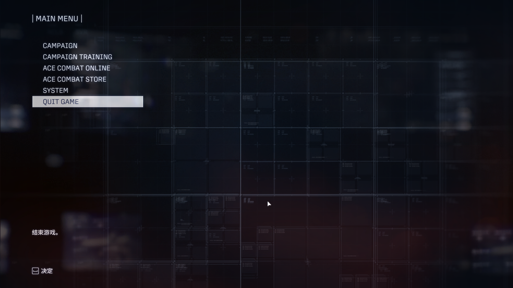
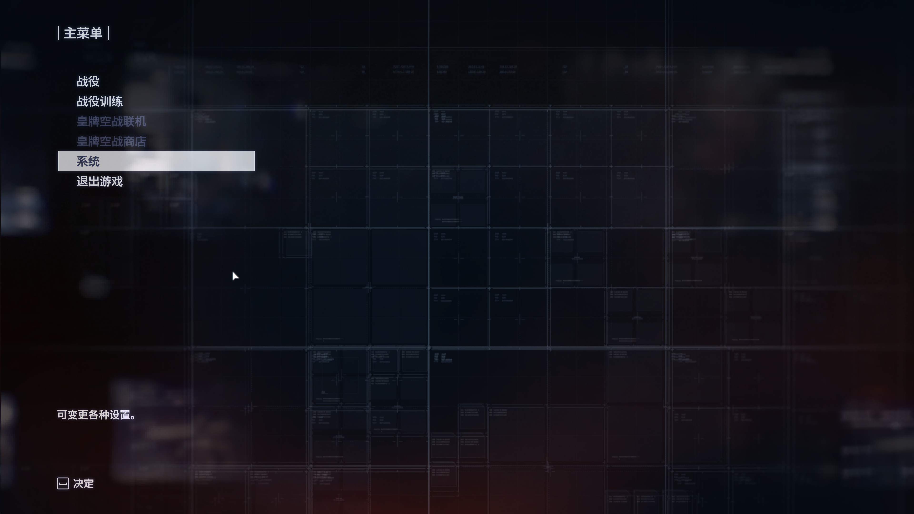
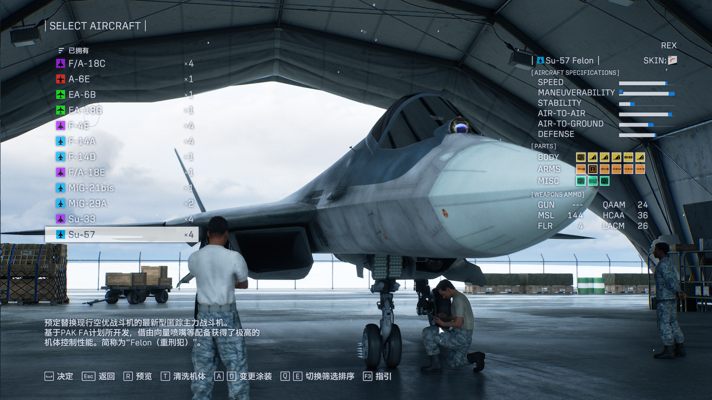
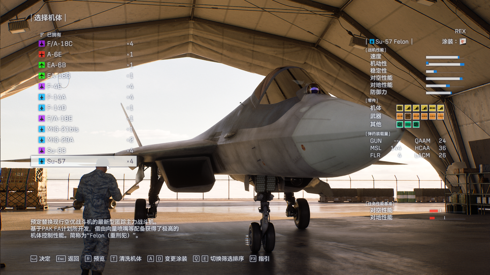

# ACE COMBAT 8 简体汉化

为 **ACE COMBAT 8: WINGS OF THEVE** 单机模式补充简体中文：菜单、机库、任务资料、结算与战斗 HUD。提供图形化 **EXE 安装器**，可选界面汉化、HUD 汉化或两者同时安装，也可解除或完全卸载。

**[下载最新安装包](https://github.com/harei-mu/AC8-Chinese-Mod/releases/latest)** · [使用说明](docs/使用说明.txt) · [注意事项](docs/注意事项.txt) · [报告问题](https://github.com/harei-mu/AC8-Chinese-Mod/issues) · [GPLv3](LICENSE)

> **仅限单机，禁止用于 ACE COMBAT ONLINE、合作、对战及其他联网任务。** 本项目没有官方授权或联机豁免。官方 EULA 也限制未经授权的游戏修改，不能承诺“允许联机”或“绝不封号”。规则见 [游戏 EULA](https://store.steampowered.com/eula/2288340_eula_0) 和[注意事项](docs/注意事项.txt)。

## 安装前确认

- Windows 10/11，64 位，Steam 正版游戏 **1.1.2.0 / build 25201480**。其他游戏版本会停止安装，请等待对应版本的汉化。
- 使用系统自带的 .NET Framework 与 Windows PowerShell，**无需另装 .NET 6/8、SDK、Python 或 Node.js**；安装、卸载、更新和汉化启动均不弹出命令行窗口。[微软的系统内置框架说明](https://learn.microsoft.com/en-us/dotnet/framework/install/versions-and-dependencies)
- 先正常退出游戏。**安装、更换、更新与卸载不会启动或关闭 Steam，也不会写入 Steam 配置文件。**
- 安装器检查其他 UE4SS MOD 或加载代理的冲突，不覆盖归属不明的文件。

## 双击安装

1. 从 Releases 下载 **AC8-Chinese-Mod-v0.3.0.zip** 并完整解压。不要只取 EXE，也不要从压缩包内直接运行。
2. 双击 **汉化安装器.exe**。它自动读取 Steam 库和游戏安装清单；未找到时点击“浏览”选择游戏根目录。
3. 选择汉化内容，点击“安装 / 更换汉化”。
4. **首次使用**：点击“复制 Steam 启动选项”，在 Steam → 游戏“属性”→“通用”→“启动选项”中粘贴。原有游戏参数会保留在复制的命令中。
5. 从 Steam 点击“开始游戏”。游戏的文本语言设置保持为简体中文。

首次需粘贴一次，是因为 Steam 缓存启动选项，外部改配置文件无法保证立即生效。后续更换组件、更新与普通卸载只需退出并重新打开游戏，**Steam 无需重启**。

| 安装内容 | 覆盖范围 |
| --- | --- |
| 界面汉化 | 菜单、设置、训练、机库、任务简报、资料、战绩、勋章与结算文字 |
| HUD 汉化 | 时间、得分、速度、高度、战斗提示、雷达与目标类别；附带中文字体 |
| 全部汉化 | 上述两部分 |

具体型号、武器型号、按键图标、坐标与玩家自定义名称保留。台风、阵风等使用惯用中文名；雄猫、猛禽等采用型号与中英昵称，例如 **F-22A 猛禽 Raptor**、**F-14D 超级雄猫 Super Tomcat**。大黄蜂的英文昵称同时保留在机型说明中，避免窄标题栏截断。

## 效果对比

用户提供的实际游戏截图展示已验证的菜单与机库效果。截图来自此前测试，不表示最新新增词条和所有页面均已完成目视检查。

| 原界面 | 汉化后 |
| --- | --- |
|  |  |
|  |  |

## 卸载与恢复联机

| 操作 | 结果 | Steam 启动选项 |
| --- | --- | --- |
| 卸载汉化 | 删除译文、字体及运行文件，仅保留很小的原生兼容入口与记录。入口转交 Steam 原始命令，不加载汉化 | 可以保留，避免 Steam 找不到启动文件 |
| 完全卸载 | 连兼容入口与记录一并移除；被用户修改过的文件保留并提示 | **先在 Steam 属性中清除汉化启动选项，再点击“完全卸载”** |

需要联机时，先退出游戏，恢复原有启动选项、完全卸载，并确认其他 MOD 已移除，再使用原始受保护启动方式。不要通过汉化入口进入联机。安装器不会修改或卸载反作弊服务。

## 检查更新

点击“检查更新”，检查本仓库最新**正式 Release**。发现新版本后由你选择下载并安装，保留当前界面 / HUD / 全部模式。取消或网络失败不会改变现有安装。

更新包必须来自本仓库，通过下载大小、GitHub SHA-256、包内清单和版本校验后，交给新的无控制台 EXE 安装。源码提交和预发布版本不会触发更新。

## 已验证与待验证

v0.3.0 包含 **1589 条补充或修订译文**；这不是逐页确认的游戏内覆盖率。

- 用户此前确认：菜单直接显示中文，字体版 HUD 中文正常、没有方框或闪烁，Su-57 已装备的彩色零件图标正常。
- 当前版实机入口：两份文字表共 **3178 次写入**，全部回读一致，没有原文或容量校验跳过；测试游戏正常退出。超长 F/A-18F 描述已修正。
- 安装测试覆盖三种组件、其他 Steam 库自动搜索、两类卸载、冲突拒绝、修改文件保留、Steam 进程及配置不变；更新测试覆盖版本筛选、来源、SHA 校验和危险 ZIP 路径。
- 新补充的王牌档案机型、资料子页、勋章和**结算页仍需逐页目视检查**。发现遗漏或截断请报告具体页面。

记录见[运行验证](reports/runtime-validation.json)、[安装验证](reports/installer-validation.json)、[更新验证](reports/updater-validation.json)和[字体验证](reports/hud-font.json)。旧版 Lua 轮询与 Frida 诊断已停用；本版在原生文字表生成后一次写入并回读，不轮询画面文字。

## 常见问题

**Steam 启动后仍是英文**：确认首次启动选项已粘贴、文本语言为简体中文，并从安装器重新安装所需模式。不要使用旧测试脚本。

**出现校验提示**：不要绕过。检查游戏版本与完整安装包。日志位于游戏目录的 Game/Binaries/Win64/AC8Chinese/Logs，公开前请隐去个人路径和 Steam 用户编号。

**机库的空方框**：未装备零件的槽位本来就是方框；不要把空槽等同于缺字。文字本身出现方框则需要报告。

**游戏更新后不能用汉化**：本版严格匹配固定游戏哈希。先退出并解除汉化，等待适配新版本，不要修改校验值。

## 开源与构建

原创安装器、脚本和译文贡献按 **GPL-3.0-only** 开源，全文见 [LICENSE](LICENSE)。第三方依赖和游戏资源保留原有许可证与权利，见[第三方说明](docs/THIRD-PARTY-NOTICES.md)。源码仓库不含原始游戏程序、DAT、工具二进制或个人 Steam 数据。

开发者请阅读[构建说明](docs/BUILD.md)、[贡献说明](CONTRIBUTING.md)和[更新日志](CHANGELOG.md)。普通玩家只需下载 Releases 的完整安装包。
